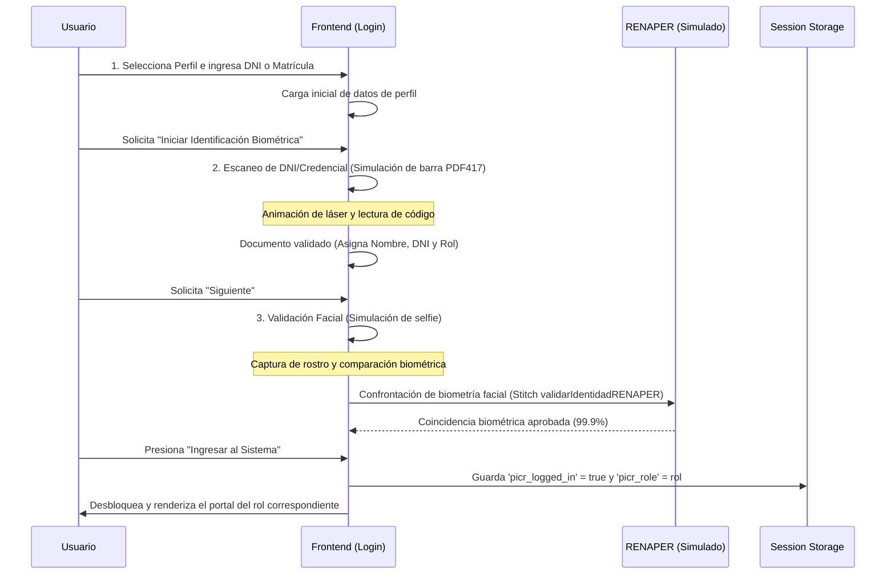

# Documento de Contexto y Arquitectura de Software: VisitApp (CABA)

> **PROPÓSITO:** Copia y pega este archivo completo en cualquier chat con una Inteligencia Artificial (como Gemini) para que el modelo adquiera el contexto completo de la aplicación, sus reglas de negocio, esquemas de bases de datos, funciones de servidor y lógica de la interfaz. Esto le permitirá comprender el sistema "de punta a punta" para proponer refactorizaciones, mejoras o resolver bugs.

---

## 🏛️ 1. Resumen Ejecutivo y Concepto General

**VisitApp** (parte de la plataforma **PICR CABA - Plataforma de Integración y Control Judicial y Penitenciario**) es una solución GovTech orientada a unificar los servicios asistenciales, de salud, educativos, y el control judicial para Familiares, Abogados y Personas Privadas de su Libertad (PPL) en el ámbito de las Alcaidías y Penales en transición a la Ciudad Autónoma de Buenos Aires (CABA).

La aplicación actúa como un portal consolidado para tres roles clave del ecosistema penitenciario:
1.  **Familiar / Visitante**: Consulta normativas, visualiza turnos asignados por el Servicio Penitenciario y de Reintegración Social, accede a recetas digitales de salud del interno, firma consentimientos médicos y realiza denuncias confidenciales con reserva de identidad (Art. 165 Ley 6.923).
2.  **Detenido / PPL**: Utiliza una interfaz simulada de terminal de autogestión intramuros para fichar asistencia laboral, inscribirse a talleres, realizar autogestión de salud (triage y cálculo de cardiotoxicidad QTc), ver material educativo de Adultos 2000 y comunicarse de forma asincrónica con familiares.
3.  **Abogado Defensor**: Coordina visitas profesionales, solicita traslados médicos o audiencias judiciales, firma escritos mediante token digital y audita de punta a punta el plan de reinserción social, el progreso de talleres, conducta y sanciones disciplinarias de sus defendidos.

> [!NOTE]
> **Evolución del Proyecto (Deprecación de Probation):** En versiones previas del diseño existía un cuarto perfil orientado a personas en régimen de libertad vigilada/asistida ("Probation"). Dicho módulo fue completamente eliminado del ecosistema de la interfaz y del flujo de negocio para especializar y robustecer los mecanismos de seguridad física, telemedicina intramuros y el control disciplinario bajo el fallo *Romero Cacharane*.

---

## 💻 2. Pila Tecnológica y Estructura del Proyecto

El proyecto está estructurado como una aplicación unificada y portátil, facilitando la portabilidad y el desarrollo ágil en entornos web/mobile híbridos:

*   **Estructura de Archivos**:
    ```text
    Visitapp/
    ├── index.html                  # Frontend SPA unificado (React 18, Babel standalone, Tailwind)
    ├── package.json                # Configuración de scripts y build de distribución
    ├── update_style.py             # Script de automatización de estilos y fuentes tipográficas
    ├── Especificacion_Arquitectura.md # Especificación técnica inicial
    ├── detalle_aplicacion.md       # Detalle funcional del sistema
    ├── arquitectura_completa.md    # Este documento de contexto técnico y reglas
    ├── backend/
    │   └── stitch_functions.js     # Funciones Serverless de MongoDB Atlas App Services (Stitch)
    └── ai/
        └── ai_system_prompt.txt    # Directrices de comportamiento y RAG para la IA oficial
    ```
*   **Frontend**: 
    - **Single Page Application (SPA)** implementada en un único archivo (`index.html`).
    - **React (v18)** cargado de forma declarativa mediante CDNs (`unpkg.com`) en modo producción.
    - **Babel Standalone** para la transpilación dinámica en el navegador del código JSX (`type="text/babel"`). Esto permite un desarrollo ágil sin necesidad de etapas complejas de build en local.
    - **Tailwind CSS CDN** para el diseño visual responsivo y adaptativo de alta densidad táctil.
    - **Lucide React** para la iconografía estilizada y consistente de cada sección.
*   **Backend / Serverless**: 
    - Funciones Javascript escritas para el entorno **MongoDB Atlas App Services (Stitch)** ubicadas en [stitch_functions.js](file:///c:/Users/23353247239/Desktop/antigravity/Visitapp/backend/stitch_functions.js).
    - Lógica de persistencia orientada a documentos de MongoDB con tipados estrictos simulados para BSON.
*   **Diseño**: 
    - Alineado con el manual de identidad visual de la Ciudad, implementando directrices del **Sistema Obelisco (GCBA)**.
    - Tipografía principal: *Nunito* para cabeceras y títulos grandes; *Open Sans* para textos de lectura e inputs.
    - Paleta de colores: Estética premium de modo oscuro táctico (`bg-slate-950`), bordes y paneles con efectos glassmorphism (`backdrop-blur-md`), y badges adaptativos (`accent-visitante`, `accent-abogado`, `accent-detenido`).

### 2.1 Sincronización Multirrol en Tiempo Real (Simulación Reactiva)
Dado que los tres portales conviven en la misma SPA para propósitos de demostración y prototipado rápido, la aplicación utiliza eventos nativos de **`localStorage` (Storage Events)**. Cuando una ventana del navegador modifica un dato (como por ejemplo el fichaje de asistencia laboral en el portal del PPL), se emite un evento que las otras pestañas abiertas (ej. el portal del Abogado) capturan de forma instantánea para actualizar su estado de React:
```javascript
useEffect(() => {
    const handleStorageChange = (e) => {
        if (e.key === 'picr_asistencia_fichada') setAsistenciaDiariaFichada(e.newValue === 'true');
        if (e.key === 'picr_puntos') setPuntosReinsercion(Number(e.newValue || '150'));
        if (e.key === 'picr_sanciones') setSanciones(JSON.parse(e.newValue || '[]'));
        // ... otros sincronizadores
    };
    window.addEventListener('storage', handleStorageChange);
    return () => window.removeEventListener('storage', handleStorageChange);
}, []);
```

### 2.2 Arquitectura del Flujo de Acceso Global Unificado (Biometría RENAPER)
En lugar de permitir ingresos directos o selectores arbitrarios de roles que comprometan el diseño del sistema, la aplicación implementa una pasarela de acceso única y estructurada en 3 pasos lógicos que simula el control de fronteras y seguridad del GCBA integrado con el RENAPER:



1. **Paso 1: Selección e Identificación**:
   El usuario selecciona su perfil (Familiar / Visitante, Abogado Defensor, Detenido / PPL) y escribe su DNI o número de matrícula letrada.
2. **Paso 2: Escaneo de DNI o Credencial**:
   Se inicia una simulación interactiva con un visor de escaneo de código de barras (PDF417) y una línea de láser roja animada. Tras completar el progreso, se recupera y muestra la información del titular de forma estructurada.
3. **Paso 3: Validación Facial contra RENAPER/SIBIOS**:
   El sistema simula el acceso a la cámara frontal del dispositivo para realizar una validación biométrica de coincidencia de rostro. Se conecta de manera interna con el servicio de validación que simula un 99.9% de precisión, aprobando el estado de validación.
4. **Cierre e Ingreso**:
   Al presionar "Ingresar al Sistema", se establece el estado global de autenticación en `isLoggedIn = true` y se guarda la sesión en `sessionStorage` para mantener la persistencia durante la navegación.

---

## 💾 3. Esquemas de Base de Datos (BSON / MongoDB)

Las colecciones están diseñadas bajo un enfoque relacional y orientadas a documentos BSON dentro de la base de datos `visitapp_db`:

### 3.1 `Unidades_Penitenciarias`
Almacena la geolocalización e información operativa de las prisiones y alcaidías bajo órbita de CABA.
```json
{
  "title": "Unidad Penitenciaria",
  "bsonType": "object",
  "required": ["_id", "nombre", "tipo_unidad", "direccion"],
  "properties": {
    "_id": { "bsonType": "objectId" },
    "nombre": { "bsonType": "string", "example": "Alcaidía de Tribunales (Unidad 28)" },
    "tipo_unidad": { "bsonType": "string", "enum": ["alcaidia", "penal"] },
    "direccion": { "bsonType": "string" },
    "geolocalizacion": {
      "bsonType": "object",
      "properties": {
        "lat": { "bsonType": "double" },
        "lng": { "bsonType": "double" }
      }
    },
    "estado_operativo": { "bsonType": "string" }
  }
}
```

### 3.2 `Normativa_Visitas`
Reglamentación dinámica y actualizada de los días de visita, horarios y objetos/vestimentas permitidos o prohibidos en cada unidad.
```json
{
  "title": "Normativa de Visitas por Unidad",
  "bsonType": "object",
  "required": ["unidad_id"],
  "properties": {
    "_id": { "bsonType": "objectId" },
    "unidad_id": { "bsonType": "objectId", "description": "Relación con la colección Unidades_Penitenciarias" },
    "horarios_visita": {
      "bsonType": "array",
      "items": {
        "bsonType": "object",
        "properties": {
          "dia": { "bsonType": "string" },
          "hora_inicio": { "bsonType": "string" },
          "hora_fin": { "bsonType": "string" }
        }
      }
    },
    "mercaderia_permitida": { "bsonType": "array", "items": { "bsonType": "string" } },
    "mercaderia_prohibida": { "bsonType": "array", "items": { "bsonType": "string" } },
    "ultima_actualizacion": { "bsonType": "date" }
  }
}
```

### 3.3 `Registro_Visitantes`
Perfiles oficiales de los familiares habilitados para interactuar con las PPL. Es agnóstico a la autenticación (Google/Firebase).
```json
{
  "title": "Perfil de Visitante",
  "bsonType": "object",
  "required": ["provider_uid", "auth_provider"],
  "properties": {
    "_id": { "bsonType": "objectId" },
    "auth_provider": { "bsonType": "string", "enum": ["google", "firebase"] },
    "provider_uid": { "bsonType": "string", "description": "ID provisto por el proveedor de autenticación" },
    "nombre_completo": { "bsonType": "string" },
    "dni": { "bsonType": "string" },
    "estado_validacion": { "bsonType": "string", "enum": ["pendiente", "aprobado", "rechazado", "requiere_subsanacion"] },
    "vinculos_ppl": { 
      "bsonType": "array", 
      "items": { "bsonType": "objectId" },
      "description": "Lista de IDs de PPL con quienes tiene vínculo familiar validado"
    }
  }
}
```

### 3.4 `Validaciones_Identidad_SID`
Traza histórica de las verificaciones biométricas de DNI y selfie realizadas contra el Sistema de Identidad Digital (SID) del RENAPER.
```json
{
  "title": "Validación Identidad SID",
  "bsonType": "object",
  "required": ["visitante_id", "token_confronte", "porcentaje_veracidad", "resultado_biometria_facial", "fecha_verificacion"],
  "properties": {
    "_id": { "bsonType": "objectId" },
    "visitante_id": { "bsonType": "objectId", "description": "Relación unívoca con Registro_Visitantes" },
    "token_confronte": { "bsonType": "string", "description": "Identificador de transacción provisto por RENAPER" },
    "porcentaje_veracidad": { "bsonType": "double", "description": "Nivel de confianza en la autenticidad física del plástico del DNI" },
    "resultado_biometria_facial": { "bsonType": "string", "enum": ["positivo", "negativo"] },
    "fecha_verificacion": { "bsonType": "date" }
  }
}
```

### 3.5 `Terminalidad_Educativa`
Progreso académico de los internos adheridos al programa "Adultos 2000" de CABA e historial de capacitaciones simuladas en Realidad Virtual (VR).
```json
{
  "title": "Terminalidad Educativa",
  "bsonType": "object",
  "required": ["visitante_id", "interno_id", "programa", "materias_aprobadas", "materias_totales", "materias_activas", "participa_activamente"],
  "properties": {
    "_id": { "bsonType": "objectId" },
    "visitante_id": { "bsonType": "objectId", "description": "Relación con el familiar en Registro_Visitantes" },
    "interno_id": { "bsonType": "objectId", "description": "Relación con el interno en Registro_PPL" },
    "programa": { "bsonType": "string", "example": "Adultos 2000 CABA" },
    "materias_aprobadas": { "bsonType": "int" },
    "materias_totales": { "bsonType": "int" },
    "materias_activas": {
      "bsonType": "array",
      "items": {
        "bsonType": "object",
        "properties": {
          "nombre": { "bsonType": "string" },
          "trimestre": { "bsonType": "int" },
          "nota_tp": { "bsonType": "double" },
          "estado": { "bsonType": "string", "enum": ["pendiente", "cursando", "aprobada"] }
        }
      }
    },
    "capacitaciones_vr": {
      "bsonType": "array",
      "items": {
        "bsonType": "object",
        "required": ["modulo", "horas_simuladas", "precision_score", "completado"],
        "properties": {
          "modulo": { "bsonType": "string", "example": "Soldadura Eléctrica Inmersiva" },
          "horas_simuladas": { "bsonType": "int" },
          "precision_score": { "bsonType": "double" },
          "completado": { "bsonType": "bool" }
        }
      }
    },
    "participa_activamente": {
      "bsonType": "bool",
      "description": "Indica si la PPL participa activamente de actividades educativas en el ciclo corriente"
    },
    "motivo_inactividad": {
      "bsonType": "string",
      "enum": ["falta_de_cupo", "ausencia_oferta_institucional", "lista_de_espera", "negativa_del_interno", "problemas_salud"],
      "description": "Causa obligatoria de inactividad si participa_activamente es falso"
    }
  },
  "anyOf": [
    {
      "properties": { "participa_activamente": { "enum": [true] } }
    },
    {
      "properties": { "participa_activamente": { "enum": [false] } },
      "required": ["motivo_inactividad"]
    }
  ]
}
```
```

### 3.6 `Registro_Salud_Intramuros`
Ficha de salud, triage autogestivo, telemetría biométrica, recetas interoperables asociadas a SNOMED CT e Historia de Salud Integrada (HSI) CABA.
```json
{
  "title": "Registro de Salud Intramuros",
  "bsonType": "object",
  "required": ["ppl_id", "unidad_id", "tipo_atencion", "fecha_hora", "estado", "hce_caba_id", "sisa_registro_id"],
  "properties": {
    "_id": { "bsonType": "objectId" },
    "ppl_id": { "bsonType": "objectId", "description": "ID de la persona privada de libertad" },
    "visitante_id": { "bsonType": "objectId", "description": "Familiar autorizado para consentimientos informados" },
    "unidad_id": { "bsonType": "objectId" },
    "tipo_atencion": { "bsonType": "string", "enum": ["clinica_general", "odontologia", "salud_mental", "telemedicina", "urgencia"] },
    "fecha_hora": { "bsonType": "date" },
    "estado": { "bsonType": "string", "enum": ["solicitado", "programado", "en_atencion", "completado", "cancelado"] },
    "hce_caba_id": { "bsonType": "string", "description": "Identificador único en la HSI de CABA" },
    "receta_renapdis_id": { "bsonType": "string", "description": "Identificador de receta en la red ReNaPDiS CABA" },
    "sisa_registro_id": { "bsonType": "string", "description": "ID de registro federado en SISA" },
    "prescripcion_snomed": {
      "bsonType": "object",
      "required": ["concepto_id", "termino_generico", "dosis_diaria"],
      "properties": {
        "concepto_id": { "bsonType": "string", "description": "Concepto SNOMED CT Edición Argentina" },
        "termino_generico": { "bsonType": "string", "description": "Nombre genérico del medicamento (Ley 25.649)" },
        "dosis_diaria": { "bsonType": "string" }
      }
    },
    "diagnostico_cie10": { "bsonType": "string", "description": "Código de diagnóstico internacional" },
    "firma_digital_token": { "bsonType": "string", "description": "Firma del profesional de la salud según Ley 25.506" },
    "lecturas_biometricas": {
      "bsonType": "object",
      "properties": {
        "presion_arterial": { "bsonType": "string" },
        "saturacion_oxigeno": { "bsonType": "double" },
        "qt_interval_ms": { "bsonType": "double" },
        "qt_corregido_ms": { "bsonType": "double" }
      }
    },
    "estado_triage": { "bsonType": "string", "enum": ["verde", "amarillo", "rojo_prioritario", "stat_escalado"] }
  }
}
```

### 3.7 `Denuncias_Seguras`
Colección que aloja los reportes de maltrato o corrupción con reserva de identidad. En cumplimiento del Art. 165 de la Ley 6.923 (CABA), se prohíbe el anonimato absoluto; el sistema encripta la identidad del denunciante en un hash asimétrico (`denunciante_hash`) y almacena la clave pública usada, accesible exclusivamente bajo orden judicial por el rol `Oficina_Transparencia`.
```json
{
  "title": "Denuncia con Reserva de Identidad",
  "bsonType": "object",
  "required": ["tipo_reporte", "descripcion", "denunciante_hash", "clave_publica_usada", "fecha_registro"],
  "properties": {
    "_id": { "bsonType": "objectId" },
    "unidad_id": { "bsonType": "objectId" },
    "fecha_incidente": { "bsonType": "date" },
    "tipo_reporte": { "bsonType": "string", "enum": ["maltrato", "corrupcion", "irregularidad"] },
    "descripcion": { "bsonType": "string" },
    "ticket_seguimiento": { "bsonType": "string" },
    "denunciante_hash": { "bsonType": "string", "description": "Hash cifrado asimétricamente de la identidad del denunciante" },
    "clave_publica_usada": { "bsonType": "string", "description": "Clave pública usada para el cifrado" },
    "estado": { "bsonType": "string" },
    "fecha_registro": { "bsonType": "date" }
  }
}
```

### 3.8 `Mensajeria_Bidireccional_Supervisada`
Bandeja de entrada asincrónica para la comunicación bidireccional entre el interno y su familiar, con soporte para moderación automática por motivos de seguridad institucional y acceso a videollamadas.
```json
{
  "title": "Mensajería Bidireccional Supervisada",
  "bsonType": "object",
  "required": ["visitante_id", "ppl_id", "remitente", "mensaje_cuerpo", "estado_moderacion", "fecha_envio"],
  "properties": {
    "_id": { "bsonType": "objectId" },
    "visitante_id": { "bsonType": "objectId" },
    "ppl_id": { "bsonType": "objectId" },
    "remitente": { "bsonType": "string", "enum": ["visitante", "ppl"] },
    "mensaje_cuerpo": { "bsonType": "string" },
    "estado_moderacion": { "bsonType": "string", "enum": ["pendiente", "aprobado", "bloqueado_sospechoso"] },
    "fecha_envio": { "bsonType": "date" }
  }
}
```

### 3.9 `Sanciones_Disciplinarias`
Colección independiente que registra las infracciones y sanciones disciplinarias de las PPL, estructurando una máquina de estados para garantizar el debido proceso legal (según fallo Romero Cacharane).
```json
{
  "title": "Sanción Disciplinaria",
  "bsonType": "object",
  "required": ["interno_id", "tipo", "descripcion", "fecha", "estado"],
  "properties": {
    "_id": { "bsonType": "objectId" },
    "interno_id": { "bsonType": "objectId", "description": "Relación con el interno en Registro_PPL" },
    "tipo": { "bsonType": "string", "enum": ["Leve", "Media", "Grave"] },
    "descripcion": { "bsonType": "string", "description": "Resumen de la presunta infracción" },
    "detalles": { "bsonType": "string", "description": "Detalle pormenorizado de los hechos y la requisa" },
    "fecha": { "bsonType": "date", "description": "Fecha del incidente o registro del hecho" },
    "estado": {
      "bsonType": "string",
      "enum": ["Activa", "Firme", "Cumplida", "iniciada", "en_descargo", "apelada_defensor", "anulada"],
      "description": "Estado del debido proceso de la sanción según fallo Romero Cacharane y flujo en frontend"
    },
    "fundamento_apelacion": { "bsonType": "string", "description": "Fundamento legal provisto por el interno o su defensor" },
    "fecha_apelacion": { "bsonType": "date", "description": "Fecha de registro de la apelación presentada" },
    "abogado_notificado": { "bsonType": "bool", "description": "Indica si el abogado defensor ha sido alertado del recurso" }
  }
}
```

### 3.10 `Registro_PPL`
Registro maestro del interno, incluyendo datos procesales y el campo dinámico de conducta.
```json
{
  "title": "Registro de Persona Privada de Libertad",
  "bsonType": "object",
  "required": ["_id", "nombre_completo", "dni", "cuij", "puntaje_conducta", "vulnerabilidades_interseccionales"],
  "properties": {
    "_id": { "bsonType": "objectId" },
    "nombre_completo": { "bsonType": "string" },
    "dni": { "bsonType": "string" },
    "cuij": { "bsonType": "string", "description": "Código Único de Identificación Judicial" },
    "delito": { "bsonType": "string" },
    "estado_procesal": { "bsonType": "string" },
    "puntaje_conducta": {
      "bsonType": "int",
      "minimum": 0,
      "maximum": 10,
      "description": "Calificación numérica afectada exclusivamente por sanciones disciplinarias que alcancen estado firme"
    },
    "vulnerabilidades_interseccionales": {
      "bsonType": "object",
      "required": ["comunidad_lgtbiq", "identidad_genero_autopercibida", "mujer_con_menores_a_cargo", "padecimiento_salud_mental"],
      "properties": {
        "comunidad_lgtbiq": { "bsonType": "bool" },
        "identidad_genero_autopercibida": { "bsonType": "string" },
        "mujer_con_menores_a_cargo": { "bsonType": "bool" },
        "padecimiento_salud_mental": { "bsonType": "bool", "description": "Salud mental bajo Ley 26.657" }
      }
    }
  }
}
```

### 3.11 `Trabajo_Intramuros`
Registro de la actividad laboral asignada a la PPL en los talleres del penal, con control de presentismo y auditoría de vacantes/oferta laboral estatal.
```json
{
  "title": "Trabajo Intramuros",
  "bsonType": "object",
  "required": ["ppl_id", "taller_id", "taller_nombre", "horas_semanales_asignadas", "participa_activamente"],
  "properties": {
    "_id": { "bsonType": "objectId" },
    "ppl_id": { "bsonType": "objectId", "description": "Relación con el interno en Registro_PPL" },
    "taller_id": { "bsonType": "string", "description": "Identificador del taller asignado" },
    "taller_nombre": { "bsonType": "string", "example": "Panadería / Carpintería" },
    "horas_semanales_asignadas": { "bsonType": "int", "minimum": 0 },
    "participa_activamente": { 
      "bsonType": "bool", 
      "description": "Indica si el interno se encuentra participando activamente del taller laboral asignado" 
    },
    "motivo_inactividad": {
      "bsonType": "string",
      "enum": ["falta_de_cupo", "ausencia_oferta_institucional", "lista_de_espera", "negativa_del_interno", "problemas_salud"],
      "description": "Motivo por el cual la PPL no cuenta con actividad laboral, obligatorio si participa_activamente es false"
    }
  },
  "anyOf": [
    {
      "properties": { "participa_activamente": { "enum": [true] } }
    },
    {
      "properties": { "participa_activamente": { "enum": [false] } },
      "required": ["motivo_inactividad"]
    }
  ]
}
```

### 3.12 `Historia_Criminologica_CABA`
Historia Criminológica Interdisciplinaria oficial (Ley 6.923 de CABA) que centraliza los informes de áreas e integra de forma obligatoria el subdocumento `Plan_De_Vida`.
```json
{
  "title": "Historia Criminológica CABA",
  "bsonType": "object",
  "required": ["_id", "ppl_id", "fecha_apertura", "Plan_De_Vida"],
  "properties": {
    "_id": { "bsonType": "objectId" },
    "ppl_id": { "bsonType": "objectId", "description": "Relación unívoca con Registro_PPL" },
    "fecha_apertura": { "bsonType": "date" },
    "Plan_De_Vida": {
      "bsonType": "object",
      "required": ["objetivos_educativos", "objetivos_laborales", "objetivos_salud"],
      "properties": {
        "objetivos_educativos": {
          "bsonType": "array",
          "items": {
            "bsonType": "object",
            "required": ["meta", "plazo"],
            "properties": {
              "meta": { "bsonType": "string" },
              "plazo": { "bsonType": "string", "enum": ["corto", "mediano"] }
            }
          }
        },
        "objetivos_laborales": {
          "bsonType": "array",
          "items": {
            "bsonType": "object",
            "required": ["meta", "plazo"],
            "properties": {
              "meta": { "bsonType": "string" },
              "plazo": { "bsonType": "string", "enum": ["corto", "mediano"] }
            }
          }
        },
        "objetivos_salud": {
          "bsonType": "array",
          "items": {
            "bsonType": "object",
            "required": ["meta", "plazo"],
            "properties": {
              "meta": { "bsonType": "string" },
              "plazo": { "bsonType": "string", "enum": ["corto", "mediano"] }
            }
          }
        }
      }
    }
  }
}
```

### 3.13 `Evaluacion_Riesgo_Actuarial`
Esquema actuarial estructurado y polimórfico para la valoración del riesgo criminológico según la Norma 841/2024 de CABA.
```json
{
  "title": "Evaluación de Riesgo Actuarial",
  "bsonType": "object",
  "required": ["_id", "ppl_id", "tipo_instrumento", "riesgo_reincidencia", "evaluador_id", "fecha"],
  "properties": {
    "_id": { "bsonType": "objectId" },
    "ppl_id": { "bsonType": "objectId" },
    "tipo_instrumento": { "bsonType": "string", "enum": ["HCR-20", "SVR-20", "SAVRY", "EPV-R"] },
    "riesgo_reincidencia": { "bsonType": "string", "enum": ["bajo", "moderado", "alto"] },
    "evaluador_id": { "bsonType": "objectId" },
    "fecha": { "bsonType": "date" }
  },
  "allOf": [
    {
      "if": { "properties": { "tipo_instrumento": { "const": "HCR-20" } } },
      "then": {
        "required": ["historial_violencia", "factores_clinicos_psiquiatricos"],
        "properties": {
          "historial_violencia": { "bsonType": "bool" },
          "factores_clinicos_psiquiatricos": { "bsonType": "array", "items": { "bsonType": "string" } }
        }
      }
    },
    {
      "if": { "properties": { "tipo_instrumento": { "const": "SVR-20" } } },
      "then": {
        "required": ["desviacion_sexual", "historial_ofensas_sexuales"],
        "properties": {
          "desviacion_sexual": { "bsonType": "bool" },
          "historial_ofensas_sexuales": { "bsonType": "bool" }
        }
      }
    },
    {
      "if": { "properties": { "tipo_instrumento": { "const": "EPV-R" } } },
      "then": {
        "required": ["violencia_intrafamiliar", "relacion_victima"],
        "properties": {
          "violencia_intrafamiliar": { "bsonType": "bool" },
          "relacion_victima": { "bsonType": "string" }
        }
      }
    },
    {
      "if": { "properties": { "tipo_instrumento": { "const": "SAVRY" } } },
      "then": {
        "required": ["factores_historicos_juveniles", "entorno_familiar"],
        "properties": {
          "factores_historicos_juveniles": { "bsonType": "array", "items": { "bsonType": "string" } },
          "entorno_familiar": { "bsonType": "string" }
        }
      }
    }
  ]
}
```

---

## 🛠️ 4. Lógica del Backend (`backend/stitch_functions.js`)

El backend expone funciones modulares de servidor preparadas para ejecutarse en el entorno Serverless de MongoDB Atlas App Services:

### 4.1 `enviarDenunciaConReserva(payload)`
-   **Propósito**: Inserta una denuncia de corrupción o maltrato con reserva de identidad, en cumplimiento del Art. 165 de la Ley 6.923 de CABA.
-   **Comportamiento**:
    -   Sanitiza los datos de entrada y valida que la descripción posea al menos 50 caracteres para evitar reportes espurios o sin contenido mínimo.
    -   Exige obligatoriamente el identificador del denunciante (`denunciante_id`) para evitar el anonimato absoluto (prohibido por la ley).
    -   Genera un ticket de seguimiento seguro formateado como `TKT-RES-XXXXXXX`.
    -   Aplica un algoritmo de hashing/cifrado asimétrico local simétrico-simulado combinando el identificador del denunciante con la clave pública de la Ciudad (`clave_publica_usada`), guardando el resultado en `denunciante_hash`. Esto asegura que la identidad real quede oculta y solo sea revelable bajo orden judicial.

### 4.2 `resolverIdentidadAgnostica(authResult)`
-   **Propósito**: Resuelve o crea perfiles de visitantes tras el inicio de sesión de forma independiente al proveedor de identidad.
-   **Comportamiento**:
    -   Mapea los campos del token de sesión de forma agnóstica (`uid` o `sub`) para ser compatible tanto con Google OAuth como con Firebase Auth.
    -   Garantiza idempotencia y previene fallos por inserciones duplicadas concurrentes mediante un bloque `try-catch` defensivo que realiza un `findOne` de recuperación en caso de colisión de índices únicos.

### 4.3 `validarIdentidadRENAPER(visitante_id, foto_dni_frente_b64, foto_dni_dorso_b64, selfie_facial_b64)`
-   **Propósito**: Simular la verificación biométrica del visitante contra el Sistema de Identidad Digital (SID) del RENAPER.
-   **Comportamiento**:
    -   Genera un porcentaje de confianza del plástico del DNI entre 85% y 100%.
    -   Genera un resultado de reconocimiento facial con 90% de probabilidad positiva.
    -   Si el porcentaje supera el 90% y el reconocimiento facial es `"positivo"`, el estado del visitante en `Registro_Visitantes` se actualiza a `"aprobado"`. De lo contrario, queda marcado como `"requiere_subsanacion"`.
    -   Registra la transacción histórica en `Validaciones_Identidad_SID` con un token de confronte único (`CONF-...`).

### 4.4 `validarYAgendarTurnoVisita(ppl_id, visitante_id, unidad_id, fecha_hora_solicitada)`
-   **Propósito**: Agenda visitas en las alcaidías garantizando que no haya colisiones en la agenda de la PPL.
-   **Comportamiento**:
    -   Chequea que el interno no posea otra visita agendada en la ventana de +/- 60 minutos solicitada.
    -   Consulta la colección `Registro_Salud_Intramuros` (tanto turnos directos como en la estructura anidada de `atenciones_clinicas`) para verificar si la PPL tiene programada una cita médica, consulta odontológica o sesión de telemedicina en la HSI en esa misma franja horaria.
    -   Si detecta conflicto, aborta e informa el error. Si está libre, inserta el turno en `Visitas_Programadas` con estado `"programado"`.

### 4.5 `procesarYModerarMensaje(payload, remitente)`
-   **Propósito**: Moderar y registrar mensajes en la mensajería familiar directa.
-   **Comportamiento**:
    -   De acuerdo a las directivas actuales orientadas a preservar la fluidez familiar y evitar censuras automáticas innecesarias, la moderación restrictiva de palabras sensibles (ej. *"fuga"*, *"dinero"*, *"droga"*) se encuentra desactivada, marcando todos los mensajes con estado de moderación `"aprobado"` de forma directa.
    -   Inserta el documento en `Mensajeria_Bidireccional_Supervisada` vinculando `visitante_id`, `ppl_id`, `remitente` (visitante o PPL), cuerpo del mensaje y fecha/hora.

### 4.6 `registrarRecetaDigitalSISA(ppl_id, prescripcion)`
-   **Propósito**: Simular el registro oficial de una prescripción farmacológica en el Sistema de Información Sanitaria Argentino (SISA) y la red nacional de recetas digitales del GCBA.
-   **Comportamiento**:
    -   Simula la obtención de un Bearer Token OAuth 2.0 válido por 30 minutos.
    -   Estructura el recurso médico siguiendo el estándar internacional **HL7 FHIR v4.0** (`MedicationRequest`) y codifica el compuesto activo mediante identificadores de **SNOMED CT Edición Argentina**.
    -   Actualiza el documento del interno en `Registro_Salud_Intramuros` vinculando los identificadores de transacción `sisa_registro_id` y `receta_renapdis_id`.

### 4.7 `procesarApelacionSancion(sancionId, fundamento)`
-   **Propósito**: Permitir al interno presentar un recurso de apelación sobre una sanción disciplinaria activa, cambiando su estado para salvaguardar el debido proceso.
-   **Comportamiento**:
    -   Verifica que la sanción exista en la colección `Sanciones_Disciplinarias` y que su estado actual permita la apelación (evitando apelar si ya está `"firme"` o `"anulada"`).
    -   Actualiza el estado de la sanción a `"apelada_defensor"`, adjuntando los fundamentos de descargo correspondientes, la fecha de la apelación y marca la notificación del abogado defensor.
    -   Inserta un registro de notificación en la colección `Notificaciones_Abogados` para alertar al abogado de la apelación presentada.

### 4.8 `aplicarImpactoSancion(sancionId)`
-   **Propósito**: Reducir el puntaje de conducta del interno basándose estrictamente en sanciones "firmes". Cumple con el Fallo Romero Cacharane y la no aplicación de castigos preventivos.
-   **Comportamiento**:
    -   Busca la sanción en la colección `Sanciones_Disciplinarias`.
    -   Verifica que el estado de la sanción sea `"firme"`. Si no lo está, aborta la operación sin descontar puntos de conducta (salvaguarda de debido proceso legal).
    -   Si la sanción está firme, calcula el descuento: Leve (1 punto), Media (2 puntos), Grave (4 puntos).
    -   Modifica el campo `puntaje_conducta` de la PPL en `Registro_PPL` restando el descuento y limitando el resultado mínimo a `0`.

### 4.9 `desencriptarIdentidadDenunciante(payload)`
-   **Propósito**: Revelar la identidad real del denunciante a partir del ticket de la denuncia.
-   **Comportamiento**:
    -   Exige que el emisor de la consulta cuente con el rol `Oficina_Transparencia`.
    -   Realiza un descifrado asimétrico simulado utilizando la clave privada institucional.

### 4.10 `procesarNotificacionSancionGrave(sancionPayload)`
-   **Propósito**: Trigger de salvaguarda legal que intercepta el ingreso de sanciones graves para garantizar el debido proceso (Human-in-the-loop).
-   **Comportamiento**:
    -   Ante una sanción clasificada como "Grave", bloquea la inhabilitación directa automática de los accesos a trabajo y educación.
    -   Modifica el estado de las inscripciones activas en `Trabajo_Intramuros` y `Terminalidad_Educativa` a "Pendiente de Revisión" en lugar de revocarlas de forma directa.
    -   Emite de forma inmediata una alerta de revisión urgente dirigida a los profesionales del Gabinete Criminológico y de Reintegración Social y al Defensor Oficial del interno.

---

## 🖥️ 5. Frontend Single-Page Application (`index.html`)

El frontend de VisitApp está consolidado en un único archivo HTML que aloja la estructura visual de la interfaz de usuario. Al iniciar la SPA, se renderiza un selector de roles y marcos de visualización específicos para simular de forma fiel la experiencia de hardware correspondiente a cada persona:

### 5.1 Envoltorios de Dispositivo (Device Frames)
*   `SmartphoneFrame`: Enmarca el portal en un diseño interactivo de teléfono móvil con barra de estado y estilos para control táctil (usado para el Familiar/Visitante).
*   `TabletFrame`: Enmarca el portal en un dispositivo de pantalla mediana (tablet), ideal para simular de forma fiel las terminales físicas de autogestión intramuros destinadas a los detenidos.
*   `FullWebFrame`: Renderiza una interfaz de escritorio completa para los paneles de gestión judicial y monitoreo de los abogados defensores.

---

### 5.2 Estructura y Módulos de los Portales

El diseño de la interfaz responde a un flujo integrado controlado por la pasarela de autenticación global:

```mermaid
graph TD
    App[Componente App.jsx - Estado Global & LocalStorage Sync]
    App --> LoginGlobal[Login Global Unificado - 3 Pasos Biométricos]
    
    LoginGlobal -->|Familiar / Visitante| PortalVisitante[Portal Familiar/Visitante]
    LoginGlobal -->|Abogado Defensor| PortalAbogado[Portal del Abogado Defensor]
    LoginGlobal -->|Detenido / PPL| PortalDetenido[Portal Detenido / Terminal Intramuros]

    subgraph PortalVisitante_Módulos
        PV_1[Inicio: Mis turnos QR y Recetario Interoperable SNOMED]
        PV_2[Agenda: Cancelación de visitas y Normativa del Penal]
        PV_3[Empleo y Educación: Seguimiento de Adultos 2000 CABA]
        PV_4[Asistencia y Denuncias: Módulo de Transparencia Ley 6.923]
        PV_5[Chat Familiar: Mensajería directa en tiempo real]
        PV_6[Consentimiento Informado: Firma digital SID integrada]
        PV_Logout[Cerrar Sesión: Limpieza global y redirección]
    end

    subgraph PortalDetenido_Módulos
        PD_1[Aula Virtual: Adultos 2000 y biblioteca de PDFs autorizados]
        PD_2[Trabajo: Fichaje diario de presentismo de talleres]
        PD_3[Salud: Formulario de triage y calculadora de cardiotoxicidad QTc Bazett]
        PD_4[Plan de Vida CABA: Indicador IRRE y Línea de Tiempo Vertical]
        PD_5[Chat Familiar: Mensajería bidireccional]
        PD_6[Legajo y Sanciones: Apelación Romero Cacharane y Bloqueos de Privilegios]
        PD_Logout[Cerrar Sesión: Botón de Salida en barra inferior]
    end

    subgraph PortalAbogado_Módulos
        PA_1[Búsqueda de Defendidos: CUIJ e Historial Disciplinario]
        PA_2[Filing de escritos: Firma Digital Tokenizada]
        PA_3[Solicitudes: Traslados Médicos y Audiencias]
        PA_4[Monitoreo: Progreso Académico y Fichaje de Talleres]
        PA_Logout[Cerrar Sesión: Botón de Salida en barra lateral]
    end

    PortalVisitante --> PV_1
    PortalVisitante --> PV_2
    PortalVisitante --> PV_3
    PortalVisitante --> PV_4
    PortalVisitante --> PV_5
    PortalVisitante --> PV_6
    PortalVisitante --> PV_Logout

    PortalDetenido --> PD_1
    PortalDetenido --> PD_2
    PortalDetenido --> PD_3
    PortalDetenido --> PD_4
    PortalDetenido --> PD_5
    PortalDetenido --> PD_6
    PortalDetenido --> PD_Logout

    PortalAbogado --> PA_1
    PortalAbogado --> PA_2
    PortalAbogado --> PA_3
    PortalAbogado --> PA_4
    PortalAbogado --> PA_Logout
```



#### A. Portal del Visitante (Familiar)
-   **Inicio y Validación Biométrica**: El portal hereda el estado de validación biométrica completado durante el login. En caso de requerir re-verificación o validación de vínculos, muestra el estado actual y permite simular la confrontación contra el SID (RENAPER) cargando DNI frente, dorso y selfie de forma local.
-   **Mis Turnos**: Muestra los turnos de visitas familiares otorgados de forma programática por el Servicio Penitenciario y de Reintegración Social junto a un código QR dinámico. Incluye un botón para realizar la cancelación irrevocable del turno.
-   **Recetario Interoperable**: Centraliza las recetas digitales activas emitidas en la Historia de Salud Integrada (HSI) del interno. Muestra códigos de barras vectoriales (SVG), dosis diaria y el principio activo codificado en SNOMED CT Edición Argentina.
-   **Seguimiento Educativo**: Panel adaptado que permite auditar las materias cursadas por el interno bajo el programa "Adultos 2000" y sus respectivas calificaciones en los trabajos prácticos.
-   **Mensajería Directa**: Canal de comunicación directo de chat asíncrono con la PPL.
-   **Módulo de Transparencia (Denuncias Art. 165)**: Formulario seguro de denuncias de corrupción o malos tratos que encripta los metadatos y el identificador en local antes de subir los reportes al servidor.
-   **Consentimientos Médicos**: Modal interactivo para firmar digitalmente la autorización de prácticas complejas sobre el interno, con firma biométrica facial.
-   **Cierre de Sesión (Logout)**: Botón situado en el pie del portal que limpia el sessionStorage y redirige inmediatamente al login global.

#### B. Portal del Detenido ("Terminal de Autogestión Intramuros")
-   **Fichaje Laboral**: Registro digital diario de presentismo en talleres intramuros (panadería, herrería, etc.). Al presionar el botón de fichar ingreso, se incrementa automáticamente la puntuación de reinserción del interno en el estado global.
-   **Aula Digital y Biblioteca**: Permite acceder de manera segura a materiales educativos aprobados y visualizar libros clásicos simulados.
-   **Triage y Calculadora QTc (Bazett)**:
    -   Permite al interno notificar dolencias físicas mediante triage.
    -   Simula la telemetría biométrica de pulso, presión y oxigenación.
    -   **Fórmula Bazett de Cardiotoxicidad**: Para mitigar riesgos cardíacos ante neurolépticos, calcula el QTc mediante la fórmula:
        $$QTc = \frac{QT}{\sqrt{RR}} \quad \text{donde } RR = \frac{60}{\text{Frecuencia Cardíaca}}$$
    -   Aplica umbrales según sexo biológico (peligro si $>450\text{ ms}$ en hombres o $>470\text{ ms}$ en mujeres). Ante peligro, gatilla estado `"STAT ESCALADO"` alertando al médico de guardia.
-   **Score de Reintegración Plan de Vida (IRRE)**:
    -   Calcula un score de reintegración de 0 a 100 de forma ponderada y dinámica usando el estado en tiempo real de estudios, talleres y sanciones:
        $$IRRE = \max\left(0, \min\left(100, \text{round}\left(50 \cdot \frac{\text{EstudiosAprobados}}{28} + 40 \cdot \frac{\text{HorasVR}}{100} - 10 \cdot \frac{\text{SancionesActivas}}{10}\right)\right)\right)$$
    -   `EstudiosAprobados`: Conteo de materias aprobadas (base inicial de 16 + cursadas aprobadas, sobre un objetivo de 28 materias).
    -   `HorasVR`: Total de horas acumuladas en capacitaciones y oficios virtuales (máximo ponderado de 100 horas).
    -   `SancionesActivas`: Cantidad de sanciones disciplinarias con estado `"Activa"`, donde cada sanción activa descuenta 10% del total.
-   **Línea de Tiempo Vertical del Plan de Vida**:
    Representa visualmente el avance del interno a través de hitos secuenciales condicionado por su desempeño e IRRE score:
    1.  *Diagnóstico*: Evaluación inicial y diseño del plan de vida (siempre marcado como completado: `done = true`).
    2.  *Tratamiento*: Ejecución activa de talleres y actividades formativas (marcado como completado si $IRRE \ge 40$).
    3.  *Confianza*: Acceso a régimen semi-abierto y salidas transitorias de reintegración (marcado como completado si $IRRE \ge 75$).
-   **Legajo Disciplinario e Impugnaciones**:
    -   Visualiza la situación procesal de la causa judicial e historial de sanciones.
    -   Permite apelar sanciones disciplinarias activas redactando descargos que se envían directamente al Abogado Defensor oficial (transicionando la sanción a `"apelada_defensor"`).
    -   El sistema bloquea privilegios automáticamente si existen sanciones de tipo "Grave" que permanezcan en estado activo.
-   **Cierre de Sesión (Logout)**: Botón de salida situado en el encabezado de pie de la terminal.

#### C. Portal del Abogado Defensor
-   **Búsqueda y Auditoría Letrada**: Búsqueda interactiva de defendidos ingresando el CUJ judicial para auditar su ficha completa.
-   **Monitoreo Integral**: Permite supervisar el progreso de talleres, presentismo, materias aprobadas y sanciones disciplinarias activas del defendido en tiempo real.
-   **Peticiones Judiciales y Firma Digital**: Formulario para radicar solicitudes de traslados sanitarios, audiencias y escritos letrados, aplicando firma digital tokenizada criptográfica (Ley 25.506).
-   **Cierre de Sesión (Logout)**: Botón "Salir" ubicado en el panel de navegación de control de defendidos activos para volver al Login Global.

---

## 🏛️ 6. Normativas y Reglas de Negocio Implementadas

El sistema responde a marcos regulatorios vigentes en la República Argentina y la Ciudad Autónoma de Buenos Aires:

1.  **Decreto 345/2024 CABA & Ley de Receta Digital (N° 27.553)**: Exigen la interoperabilidad nacional en salud digital. Las prescripciones deben emitirse utilizando terminología unificada SNOMED CT e integrarse en repositorios del SISA/ReNaPDiS. En este ámbito, la **Fórmula de Bazett de Cardiotoxicidad** se implementa como control preventivo digital de telemedicina para vigilar la dosificación de antipsicóticos.
2.  **Ley de Firma Digital (N° 25.506)**: Regula las firmas electrónicas y digitales basadas en criptografía de clave pública (tokens del abogado y consentimientos médicos del visitante).
3.  **Ley de Derechos del Paciente (N° 26.529)**: Establece el derecho a recibir información clara sobre tratamientos y a manifestar el consentimiento informado, el cual puede ser otorgado por un familiar directo en entornos de encierro.
4.  **Ley 6.923 CABA (Art. 165) & Reserva de Identidad**: Prohíbe el anonimato absoluto en denuncias de maltrato o corrupción. El sistema implementa la reserva de identidad confidencial, encriptando la identidad del denunciante mediante un hash asimétrico (`denunciante_hash`) accesible únicamente por la Oficina de Transparencia bajo orden formal.
5.  **Sistema de Diseño Obelisco (GCBA)**: Define directrices de legibilidad, contraste y jerarquías tipográficas accesibles para portales oficiales gubernamentales.
6.  **Debido Proceso Disciplinario (Fallo "Romero Cacharane" y Res. N° 530/20)**: Prohíbe cualquier tipo de sanción anticipada o bloqueo automático de actividades de reinserción (trabajo y educación) para sanciones que no cuenten con condena/resolución administrativa firme. Asimismo, la afectación del puntaje conductual (`puntaje_conducta`) solo procede exclusivamente ante sanciones disciplinarias firmes. El trigger serverless `procesarNotificacionSancionGrave` y el indicador `IRRE` respetan este mandato legal al mantener los accesos en estado de "Pendiente de Revisión" en lugar de inhabilitarlos de forma automática.

---

## 🤖 7. Asistente de IA (System Prompt Integrado)

El asistente virtual integrado en el portal actúa como guía institucional. El archivo `ai/ai_system_prompt.txt` establece las siguientes directivas para su funcionamiento:

1.  **Orientación Humana**: El bot debe responder de manera calmada, empática y clara, dada la situación de vulnerabilidad o estrés de los familiares de las PPL.
2.  **Evitar Alucinaciones**: Solo debe responder con información contenida en las normativas provistas (RAG) o listados de la base de datos.
3.  **Marcado de Incertidumbre (`{{PENDIENTE_VALIDACION_OFICIAL}}`)**: Si un usuario pregunta sobre el ingreso de un alimento u objeto no clasificado específicamente en la lista de permitidos o prohibidos por la unidad penitenciaria, el bot debe responder obligatoriamente:
    > *"La normativa actual de esta unidad respecto a [OBJETO] se encuentra {{PENDIENTE_VALIDACION_OFICIAL}}. Por favor, contacte telefónicamente a la Unidad o absténgase de llevarlo para evitar sanciones."*
4.  **Desvío de Denuncias**: En caso de reportes de maltrato o corrupción, debe evitar interrogatorios o interpretaciones de culpabilidad y derivar directamente al usuario al Módulo de Denuncia con Reserva de Identidad.

---

## 💡 8. Guía para Prompting y Propuestas de Mejora

Si deseas solicitarle a Gemini (u otra IA) cambios y mejoras en el código utilizando este archivo como contexto, aquí tienes ejemplos de prompts efectivos:

### Ejemplo de Prompt 1: Migración de Arquitectura Monolítica a Modular (Vite/React)
> *"Basándote en el archivo index.html detallado en la arquitectura, escribe un plan paso a paso y el código necesario para modularizar la aplicación. Divide index.html en componentes React individuales (.jsx), un router usando React Router v6, y configura un archivo vite.config.js para el empaquetado del proyecto, manteniendo los mismos estilos y animaciones customizados del Obelisco."*

### Ejemplo de Prompt 2: Refactorización del Backend a un Server REST (Node.js Express / NestJS)
> *"Toma como referencia las funciones simuladas de MongoDB Stitch en backend/stitch_functions.js y genera una aplicación API REST completa utilizando Node.js y Express (o NestJS) y Mongoose. Incluye la definición de esquemas de datos correspondientes a la especificación de colecciones del documento de arquitectura, las rutas HTTP, y añade la validación real de esquemas usando Joi o Zod."*

### Ejemplo de Prompt 3: Integración Real con APIs Externas (RENAPER / SISA)
> *"Modifica la función del backend validarIdentidadRENAPER y registrarRecetaDigitalSISA para reemplazar las simulaciones matemáticas por llamadas HTTPS reales (`fetch` o `axios`) a endpoints RESTful simulados del RENAPER (cruce biométrico) y del SISA (registro FHIR HL7 en ReNaPDiS). Incluye el manejo de headers de autenticación Bearer y control de errores HTTP."*

### Ejemplo de Prompt 4: Implementación de State Management Global (Zustand / Redux)
> *"Actualmente la aplicación sincroniza la información multirrol escribiendo y leyendo en localStorage y escuchando eventos 'storage'. Escribe el código necesario para reemplazar esto con una arquitectura de gestión de estados global usando Zustand (o Redux Toolkit), creando stores específicos para salud, visitas, educación, y un mecanismo de simulación de mensajes inter-ventanas seguro."*

### Ejemplo de Prompt 5: Comparación y Contraste con el Proyecto `EDP_Dashboard`
> *"Basándote en este documento de arquitectura de VisitApp (PICR CABA), realiza un análisis comparativo y de transferencia de componentes contra el proyecto EDP_Dashboard. Identifica y detalla cómo se pueden extrapolar e implementar en EDP_Dashboard los siguientes patrones arquitectónicos: 1) El flujo de Login Unificado Global con validación biométrica en 3 pasos (confronte RENAPER/SIBIOS); 2) El mecanismo de sincronización de estados multirrol en tiempo real entre pestañas (Storage Events); 3) La calculadora integrada con lógica clínica automatizada (fórmula QTc Bazett) y estados de triage prioritarios (rojo obelisco)."*

---

## 📊 9. Datos de Ejemplo (Seed Data) para Testeo

### 9.1 Documento de Salud en `Registro_Salud_Intramuros`
```json
{
  "_id": { "$oid": "60b8d4f2f7b2c2a1c8b3e510" },
  "ppl_id": { "$oid": "60b8d4f2f7b2c2a1c8b3e501" },
  "unidad_id": { "$oid": "60b8d4f2f7b2c2a1c8b3e401" },
  "tipo_atencion": "telemedicina",
  "fecha_hora": { "$date": "2026-06-10T10:00:00Z" },
  "estado": "programado",
  "hce_caba_id": "HCE-CABA-7718293-F",
  "receta_renapdis_id": "RENAPDIS-REC-88291039",
  "sisa_registro_id": "SISA-TX-3382910328",
  "prescripcion_snomed": {
    "concepto_id": "429215003",
    "termino_generico": "Haloperidol 5mg (Neuroléptico)",
    "dosis_diaria": "1 comprimido cada 24 horas"
  },
  "diagnostico_cie10": "F20.0 (Esquizofrenia paranoide)",
  "firma_digital_token": "SHA256-RSA-EFE889210B3E42D771B",
  "lecturas_biometricas": {
    "presion_arterial": "120/80",
    "saturacion_oxigeno": 98.2,
    "qt_interval_ms": 390.0,
    "qt_corregido_ms": 421.0
  },
  "estado_triage": "verde"
}
```
